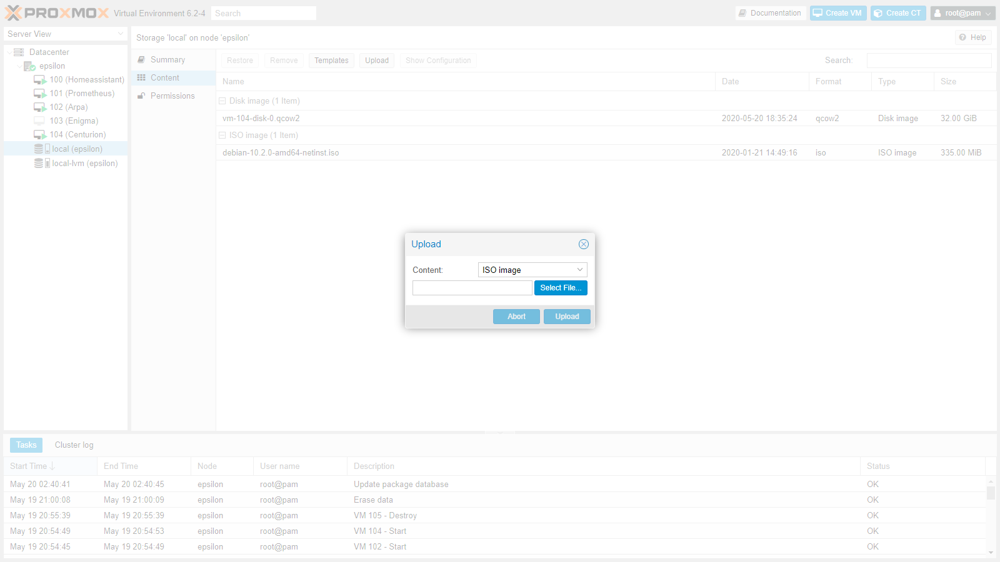
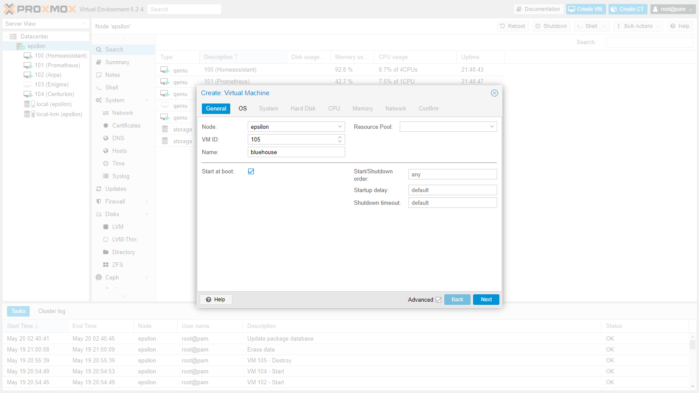
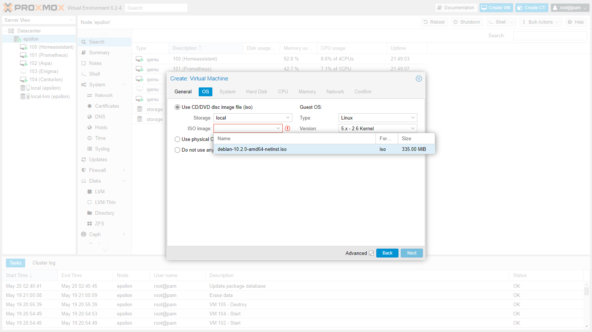
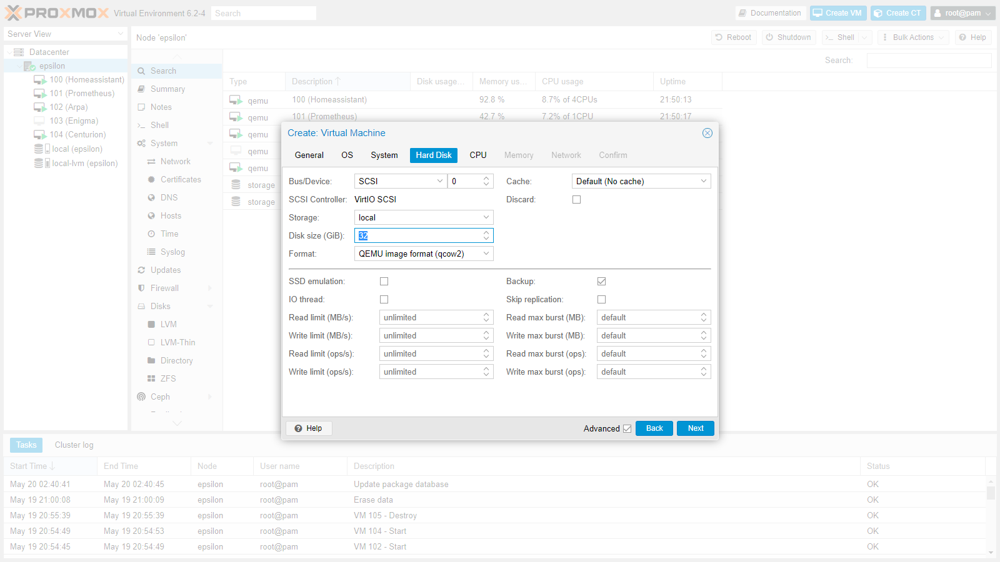
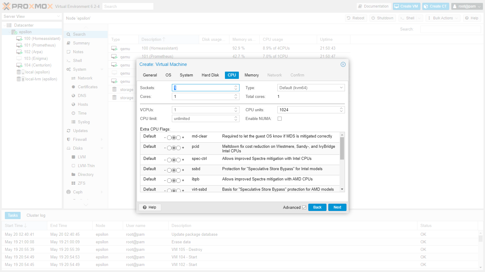
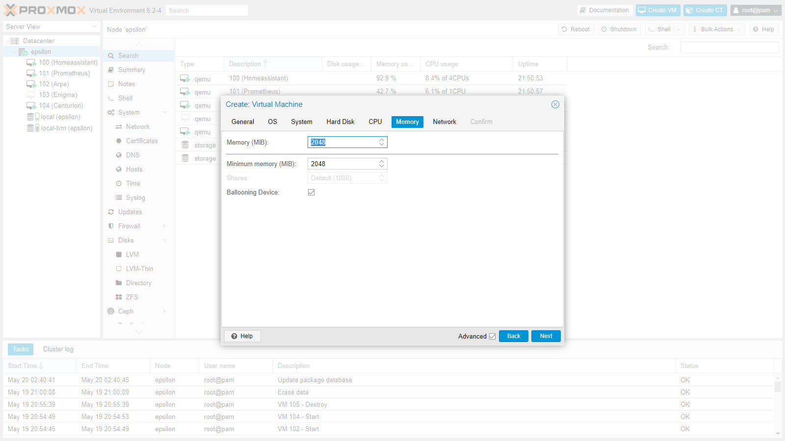
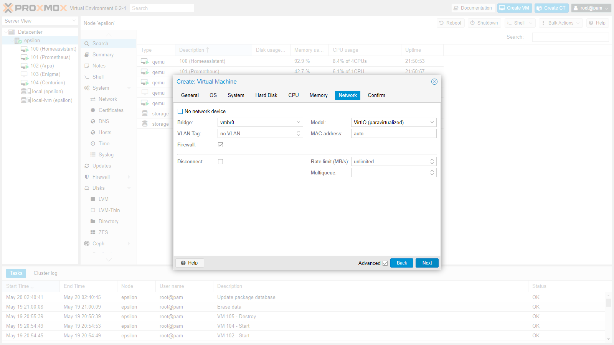
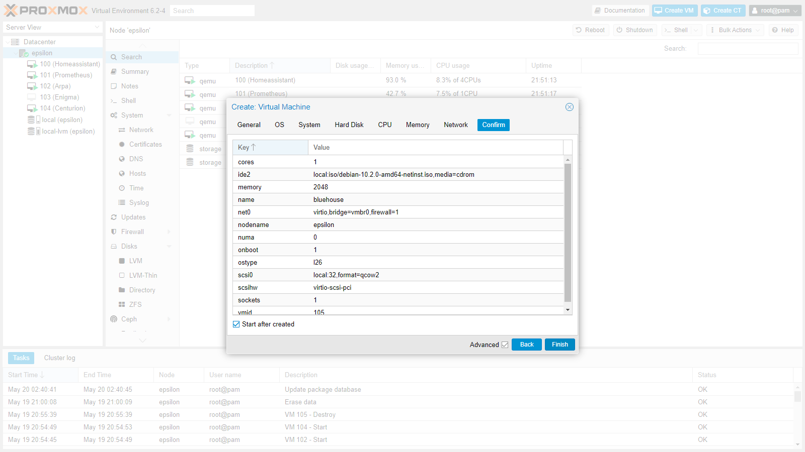

# Creating a Debian VM in proxmox

This page is to explain the process of generating the VM and getting to the point of installing and configuring Debian

## Get Debian

**Project: Blue House** uses Debian because it has good package management and is easy to set up as a headless server. It is a tried and tested method.

 - If this is your first **VM** Download the latest minimal Debian ISO from [here](https://www.debian.org/distrib/netinst) - get the AMD64 version.
 - If this is not your first **VM** you only need to check if the one you already have is up-to-date.
 
 
## Put the Debian ISO on to your Proxmox machine
 
Note: If this is not your first **VM** and you are happy you have the latest version already on your Proxmox you do not need to do this step again.

 - Navigate to your Proxmox webUI in your browser.
 - Expand the entry of your **grey house** node in the tree on the left (under 'Datacentre')
 - Press on the 'local' storage entry in the tree
 - Press on 'Content' in the menu
 - Press 'Upload' in the top bar
 - Press 'Select file'
 - Upload your Debian ISO
 
 
 

# Create a new VM

Ensure your **grey house** node is selected in the tree on the left (under 'Datacentre') and press 'Create VM' in the top bar.  If not already done, check the 'Advanced' check box at the bottom of the new window.

Type a name for your **VM** in the 'name' box and select the 'Start at boot' checkbox.

Select your Debian ISO from the dropbox.

Set the size you want your **VM's** hard drive to be.

Set how much processing power you want to allocate to the **VM**

...and the amount of RAM.

Leave the network settings as they defaulted to.

Check the 'Start after created' box and press finish.

Watch your Proxmox WebUI for a few moments and you will see your new **VM** spring to life (a little green 'play' symbol will appear next to it in the tree).  Now ensure that your new **VM** is selected in the tree and press the Console button in the top panel.

Your new **VM's** 'monitor' now appears in a window and you find yourself at the Debian install menu...

Now continue with the 'Creating a Debian base instructions'...
