# Install and configure proxmox to create your 'Grey House'

## Installing

On your **laptop** use BalenaEtcher to write the proxmox iso file to a USB stick.

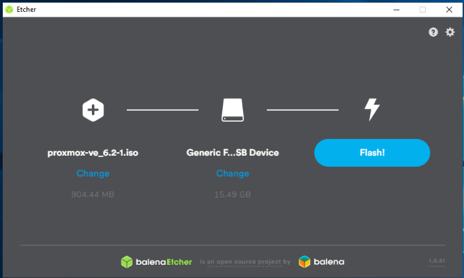

Once it's done put the USB stick in to your **host** , make sure it is connected to ethernet, keyboard, mouse and monitor and turn it on.  Access the BIOS of the **host** (usually by pressing DEL or f12).

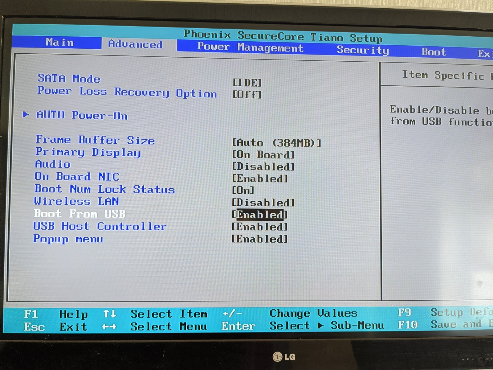

Ensure that the options are selected to enable booting from USB (above), and that your USB stick is the primary boot device (below).  Your BIOS options may look completely different, but these settings should be relatively easy to find.  Save and exit BIOS.

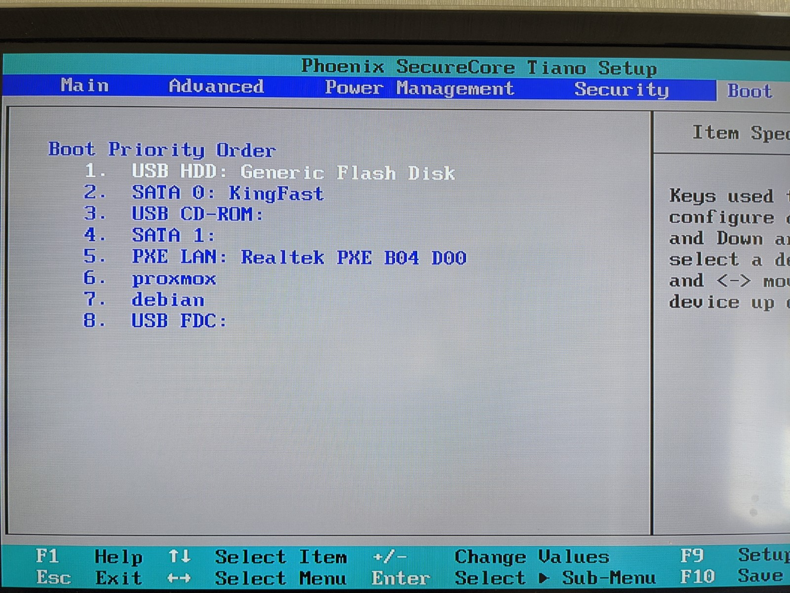

The system boots from your USB stick and presents you with the installation menu...

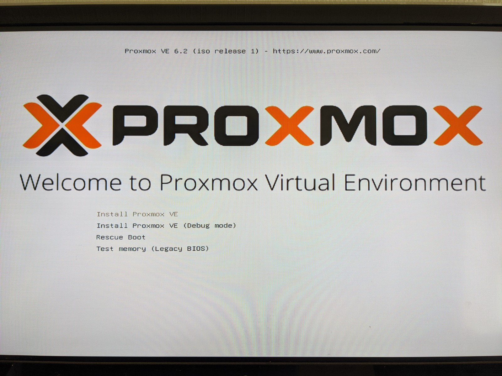

'Install Proxmox VE' is already highlighted, press enter.

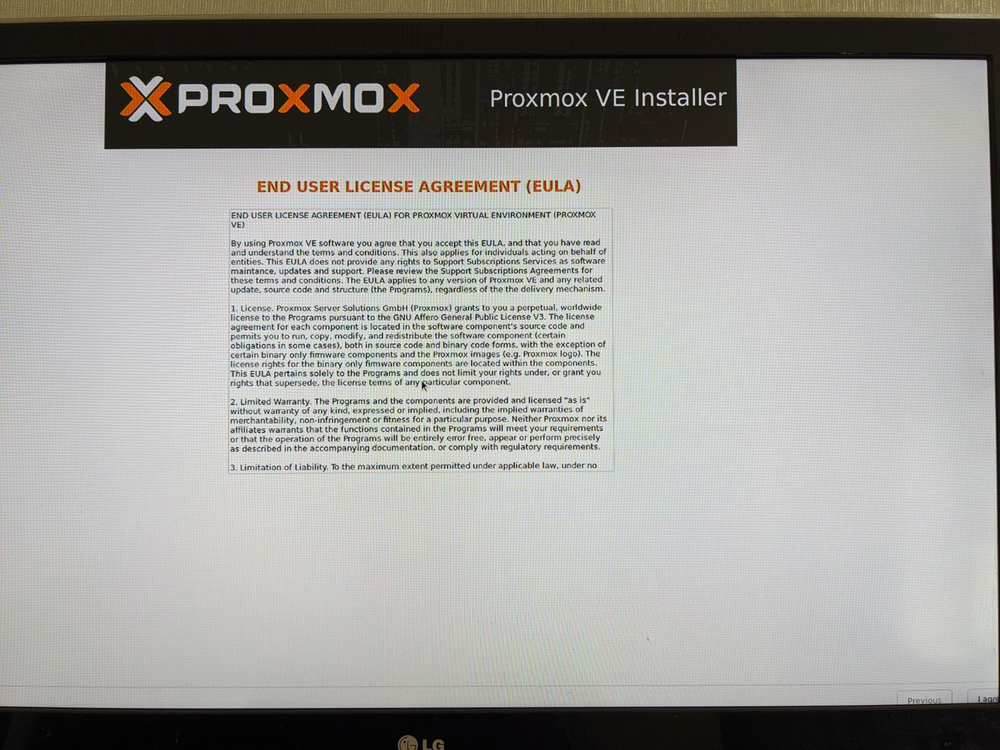

Accept the EULA by pressing 'next' in the bottom right hand corner of the screen.  (At this point I'm just going to apologise for the screenshots - in order to write this guide I plugged a spare computer in to my main TV and just took photos with my phone.  You'll also notice that the window doesn't quite fit the display and the buttons are disapearing off the bottom!  It should be good enough for you to get the gist, screenshots on other pages are actual proper screenshots from working instances!).

The next page allows you to select which hard disk to install to.  Press next.

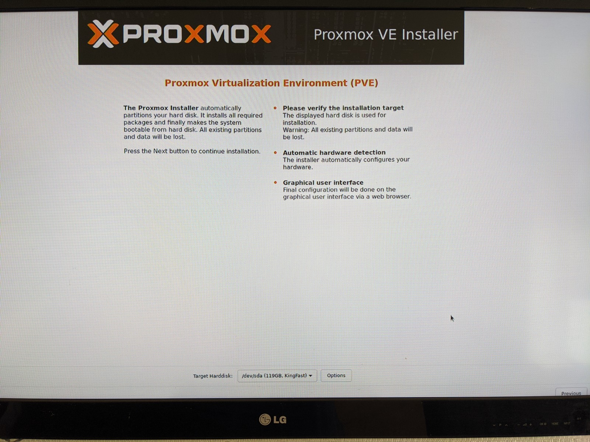

Start typing your country in to the top box and select yours when it is short-listed.  The system will best-guess your timezone and keyboard layout.  Correct these if neccessary and press next.

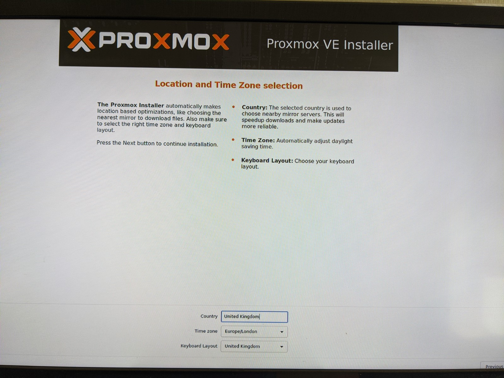

Add a reasonably strong password to the next page.  This will be your root password for your **grey house** and will be the only line of defense for preventing people accessing your whole system so it wants to be secure, but also something you will not forget and can type relatively easily.  More on why we just use root on proxmox later.  Press next.

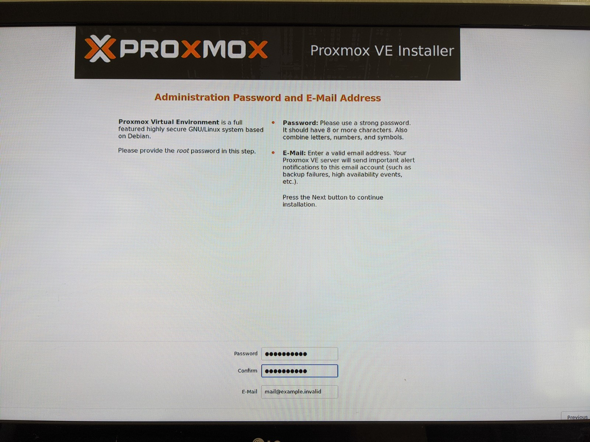

On the next page you configure the network.  The top box let's you choose your main network interface if you have more than one.  The second box is the name you choose for your **grey house**, I've used 'greyhouse' and then add .local to the end (greyhouse.local).  The third one is the IP address you want your **grey house** to have, pick one that's free on your network.  The fourth box is your netmask, if you don't know what this is 255.255.255.0 will probably do you.  The fifth box is the IP address of your gateway (usually your router).  And finally your DNS server, you can leave this the same as your router if you don't have a seperate DNS.  DON'T USE 127.0.0.1 LIKE THE SCREENSHOT!!!  Press next.

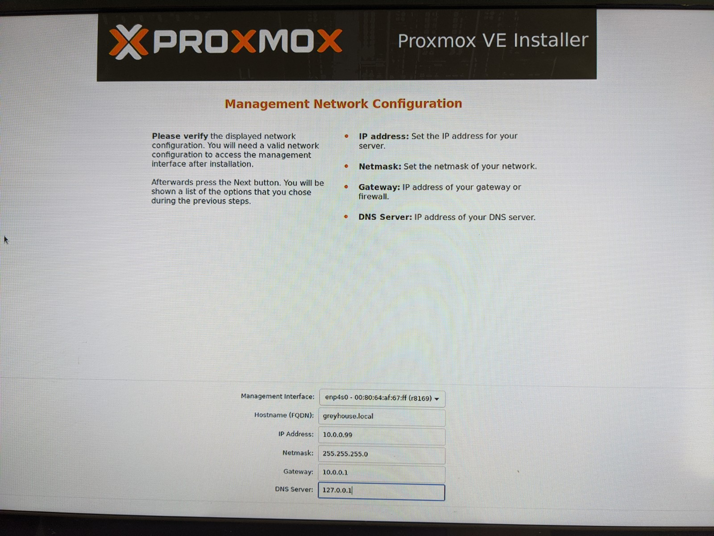

Quick double check of the summary for any glaring errors and press install.

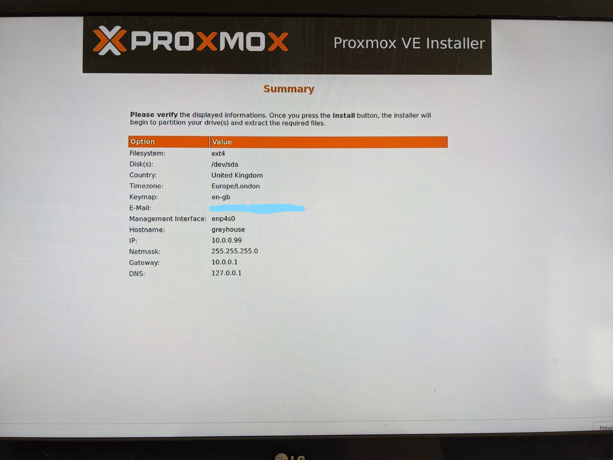

After a while it will be installed and you'll press reboot.  As it reboots, catch it and go back in to your **host's** BIOS.  Disable boot from USB, and move the UEFI entry for proxmox to the primary boot device.  Save and exit.

You can now disconnect the keyboard, mouse and monitor from the **host**.  Wait a few minutes and access the Proxmox webUI from your laptop by typing your **grey house's** ip address in to the address bar and adding port 8006 (eg. http://10.0.0.99:8006 )


## Configuring

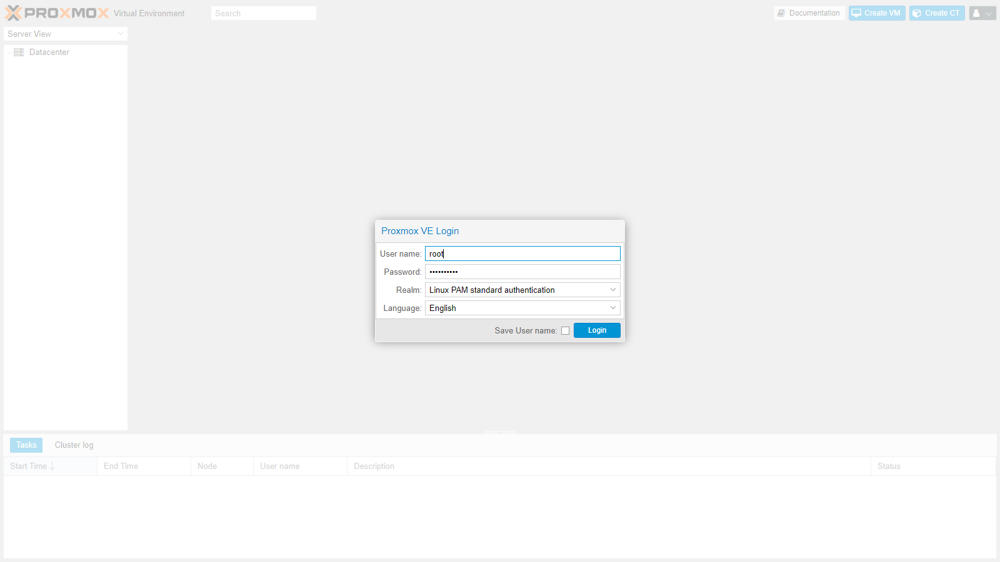

Type 'root' in to the username box and the password you set during installation in to the password box to login to your Proxmox webUI.  The first thing you'll see is a warning that you don't have an active subscription.  You should consider subscribing to one of the lower teir plans, but if you do not want to you can continue using proxmox for free.  Unfortunately if you do not have a subscription without a minor modification the warning will appear every time you login, so lets use a script that removes it and keeps it removed. 

Source: [pve-nag-script](https://github.com/foundObjects/pve-nag-buster)

Press on the name of your **grey house** node in the tree on the left (under 'Datacentre'), and then in the top right press the 'shell' button.  This is a root shell, be careful to only use this when neccessary (which won't be very often at all!).

Type:

```bash
wget https://raw.githubusercontent.com/foundObjects/pve-nag-buster/master/install.sh
bash install.sh
chmod +x install.sh && ./install.sh
```

This script will also ensure that we can download updates from the 'free' proxmox repositroy, which was not configured by default.

Type 'exit' to close the terminal connection and shut the window.  Normally when working in the terminal we avoid root, but with proxmox we only use the root login.  This is basically because nearly everything you do on proxmox requires root privelege, and as we won't be exposing our **grey house** server directly to the internet, and everything that we do on this server will be virtualised, the only real 'attack vector' for your **grey house** is if someone is in your house, at which point having a root login is the last of your worries.  On all of our VM's we will be disabling the root account and using elevated permissions only when we require them.

Now we'll make sure Proxmox is up to date, by pressing on the name of your **grey house** node in the tree on the left (under 'Datacentre'), and then updates in the menu.  You can press the refresh button on the top bar to check for updates, and if there are updates you can press the upgrade button on the top bar to install them.

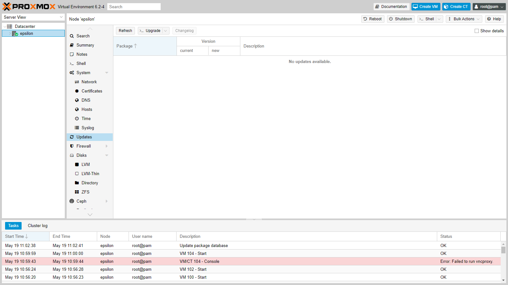

Your Proxmox server is now ready to add some VMs.
