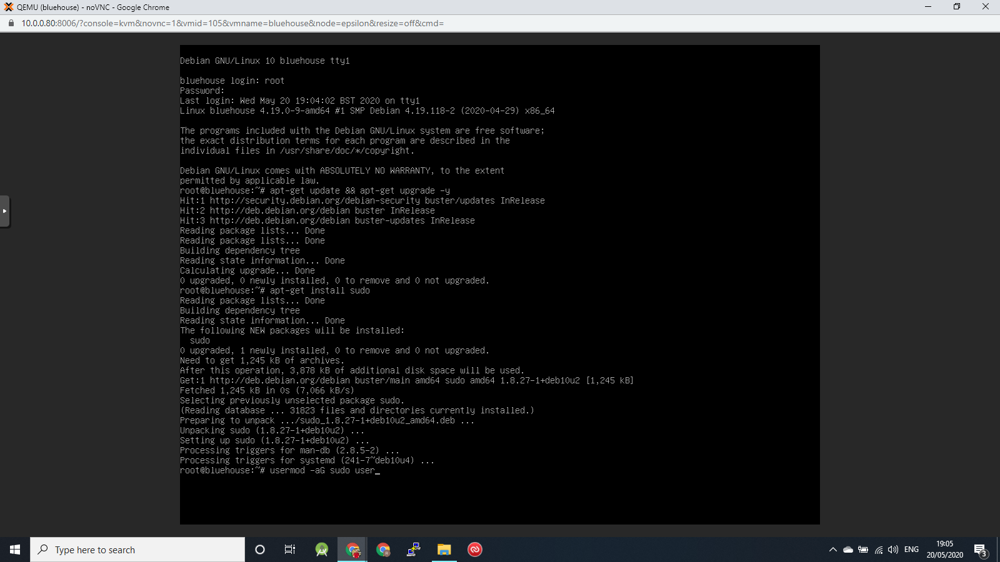
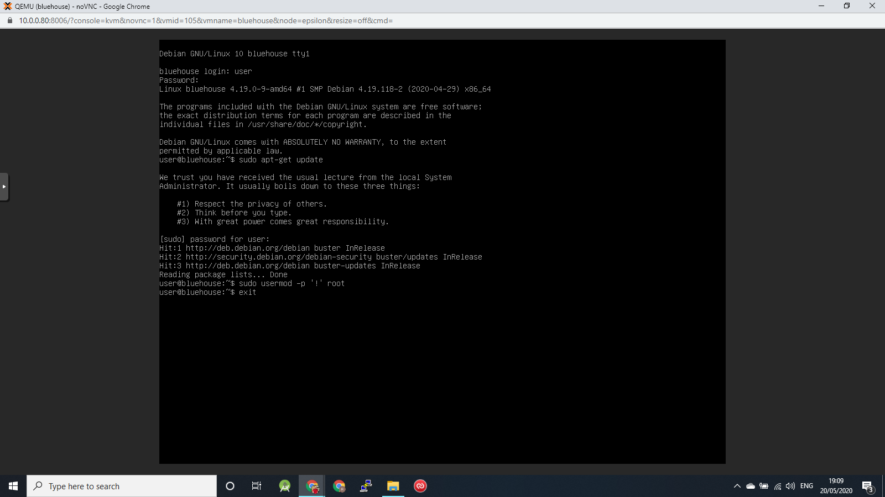
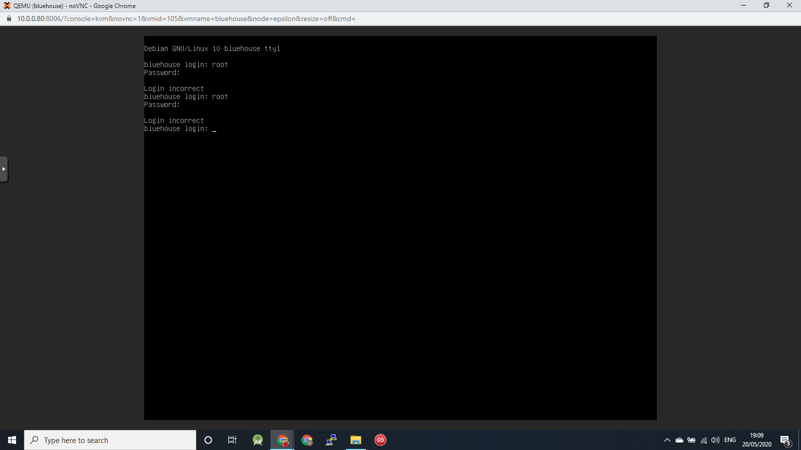
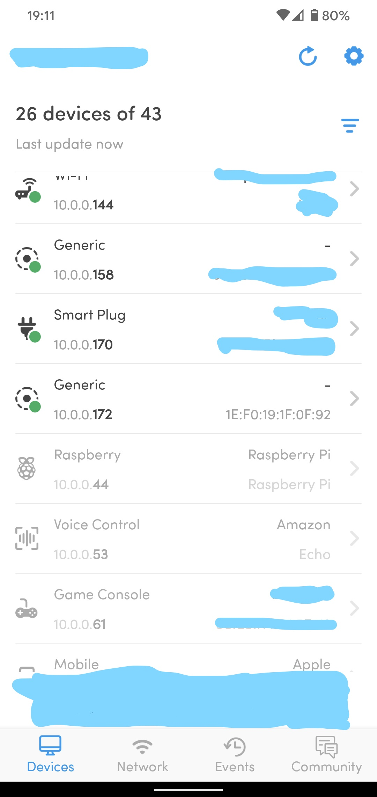
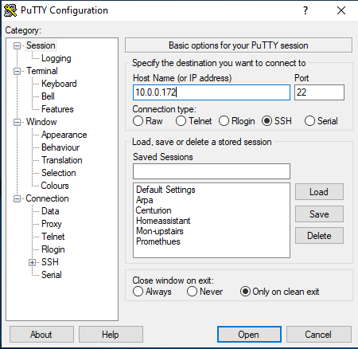
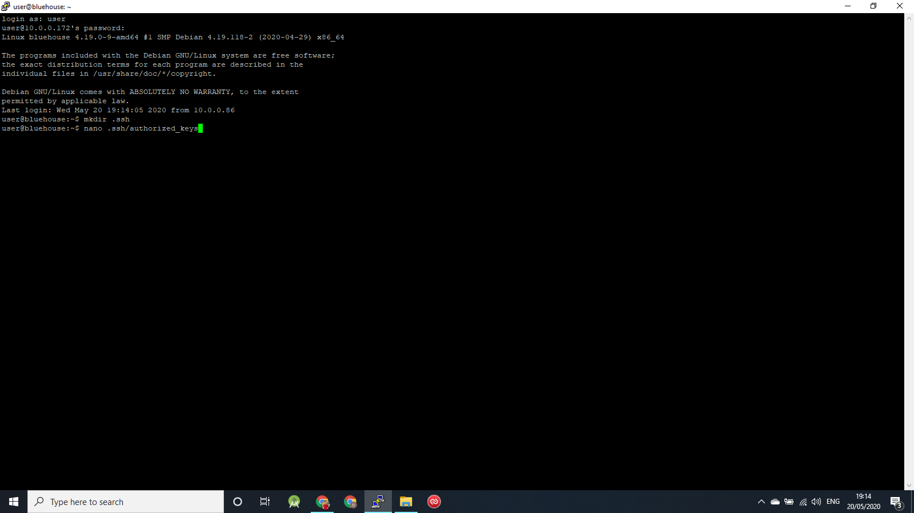
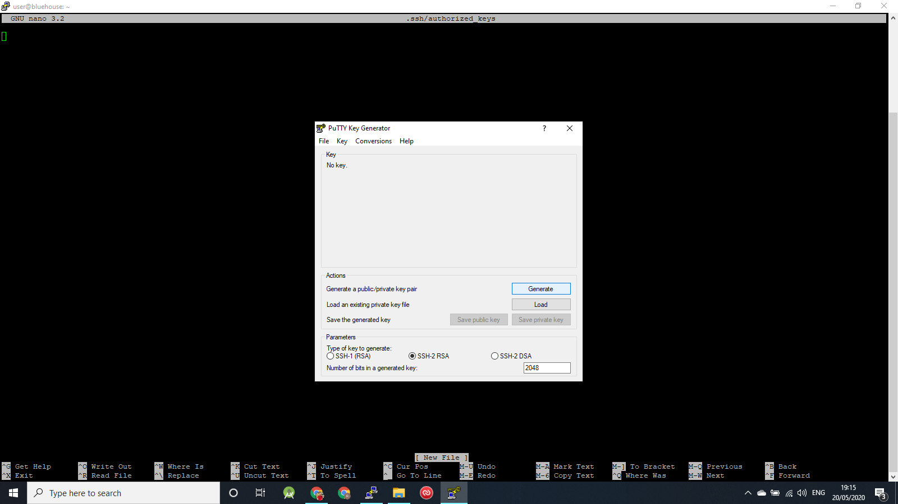
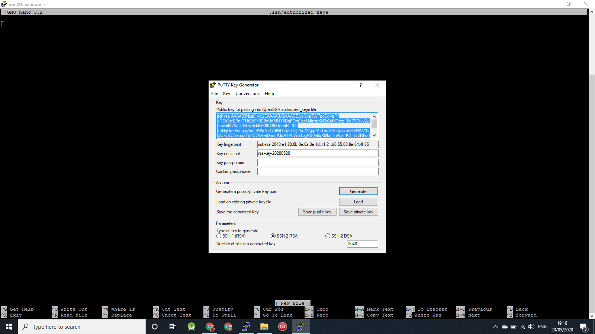
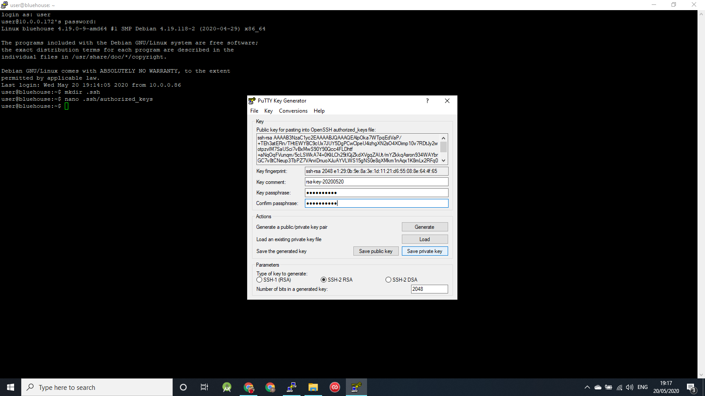

# This page is about securing your logins to your Debian machine

This is presumed to be on a fresh install having just come from the 'Installing Debian' page.  This is part 2 of 3 of installing and configuring your 'base system'.

## Configure sudo

At this point you should be staring at the login prompt for a fresh install, where you set up a root user with a password and a 'control' user with a password.  We will use that user for pretty much everything, but first we have to set up sudo so that we can use elevated priveleges when we need to, so first we must login as root.  Type 'root' at the login and press enter, then type your password (nothing will appear on the screen as you type - that's normal!) and press enter.

Now is also a good time to make sure the system is up to date, so run

```bash
apt-get update && apt-get upgrade -y
apt-get install sudo
```
 
The first line updates your repositories and upgrades anything that needs to be upgraded, the second line installs the sudo program.  

We then need to allocate sudo permissions to your user, so type:

```
usermod -aG sudo user
```

(replacing 'user' with your username)

Your screen should now look something like this:



Now type 'exit' and press enter to logout of root and return to the login prompt.  Login as your user.

Check that your user does have sudo permissions by running apt-get update

```
sudo apt-get update
```

You should see a warning (this will only appear once), and then have to put in your password.  This is your users password, not the root users password.  Once the password is entered succesfully the command should run and update the repositories.  IF IT DOESN'T, DO NOT PROCEED AND ASK FOR HELP!!

Asuming you just succeeded and proved you do have sudo priveleges, we are now going to disable all logins to the root user by creating a password that cannot exist

```
sudo usermod -p '!' root
```

Your screen should now look like this...



Type 'exit' and press enter to logout.  You now should not be able to login as root...



Now we're going to drop back to configuring things remotely from our **laptop** - if you're in a **VM** simply close the Console window.  If you're running Debian directly on the **host** (Single Purpose Install) then you can disconntect your monitor, keyboard and mouse now.

## Configuring SSH

Using your networking scanning tool on your **mobile** see what IP address your machine has been allocated..



Open Putty on your laptop and type the IP address in to the main bar and press Open.



A new window opens (accept the warning, this will only apear once) that is a terminal on your Debian machine.  Login with your username and password.



As discussed in the 'Security' page we are going to disable password logins by SSH and create a shared key which we will store on our **laptop**. Only your **laptop** will be able to connect via SSH in the future.  The only way to login with a password is to have physical access to the machine.  As per the screenshot, first we create the file to store the shared key in...

```
mkdir .ssh
nano .ssh/authorized_keys
```

This opens a blank text file.  Leave this open in the background for a minute.

When we installed Putty it installed a suite of tools for using SSH.  One is called PuttyGen, which we use to create the keys.  Open it now...



Press Generate, and then move your mouse around randomly on the grey panel.  This action generates the randomness that creates the key.  After a short while your new key will appear.  Highlight it all with your mouse and press ctrl+C to copy it to the clipboard.



Keep PuttyGen open in the background and go back to your blank text file in your terminal window and paste the key (press the right mouse button).  It is a LONG key so you will only see the last few digits of it initially after you paste.  Press the 'Home' key on your keyboard to jump back to the start of the line and make sure the key starts with 'ssh-rsa'.  Press ctrl+O to save the file.  Press enter to confirm.  Press ctrl+X to exit the file.

Now go back to PuttyGen and enter a passphrase for your private key file.  Press Save Private Key and choose a location to save the file.




# Configure Pageant

Now that we have set up the ssh key on your Debian machine, we now set up Pageant to load the keys on our **laptop** so it can authorise us when we login.
(Set Up Pageant)

(Test login with key)

(Disable password logins)

(Test)

(Set Pageant to boot with windows)


