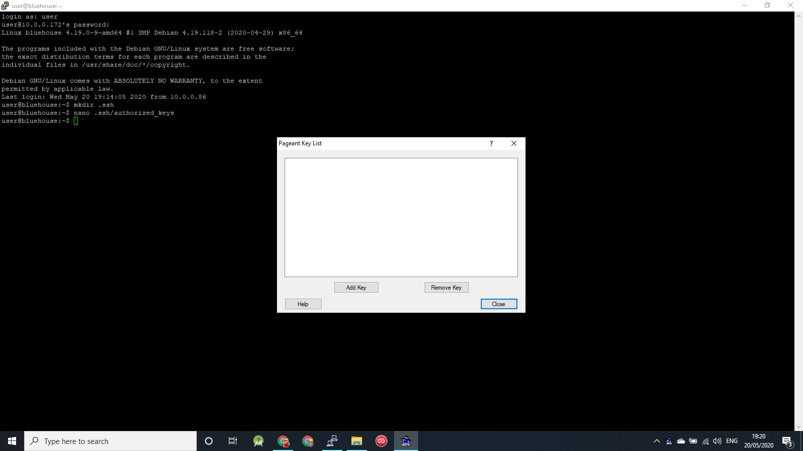
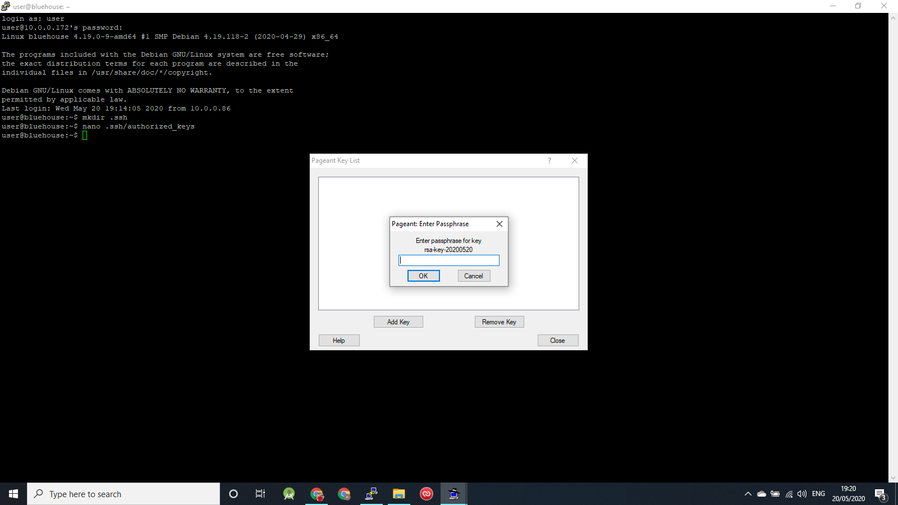
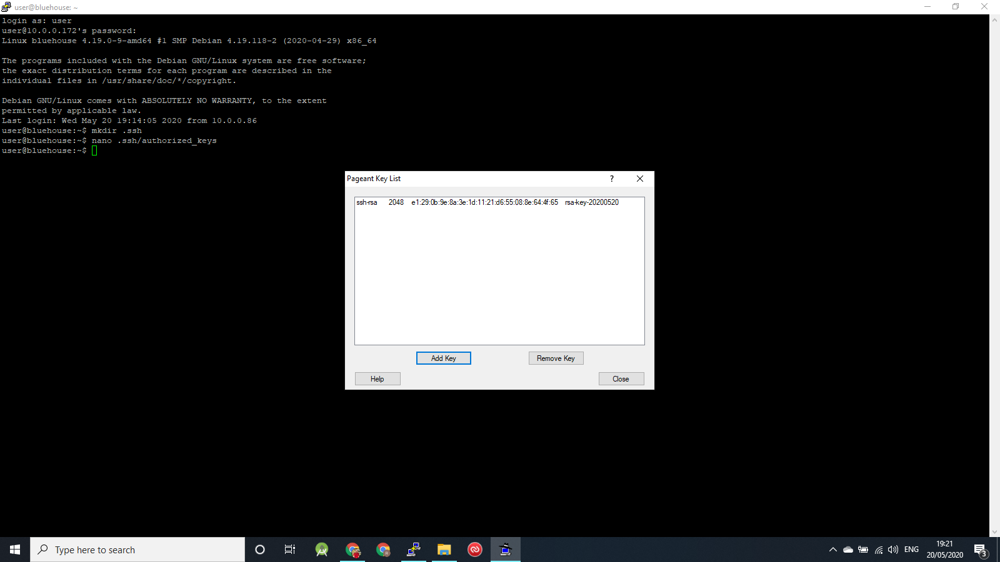
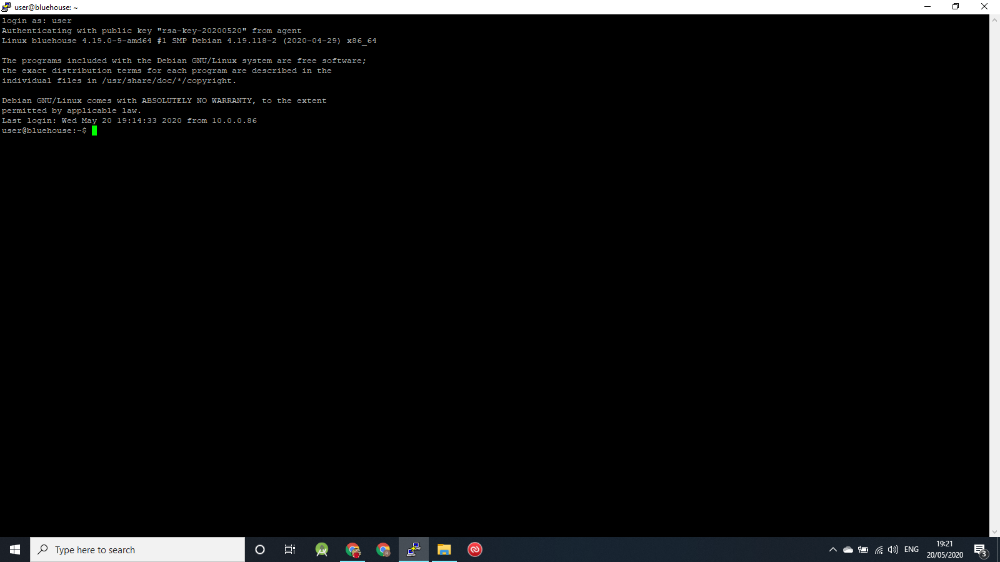
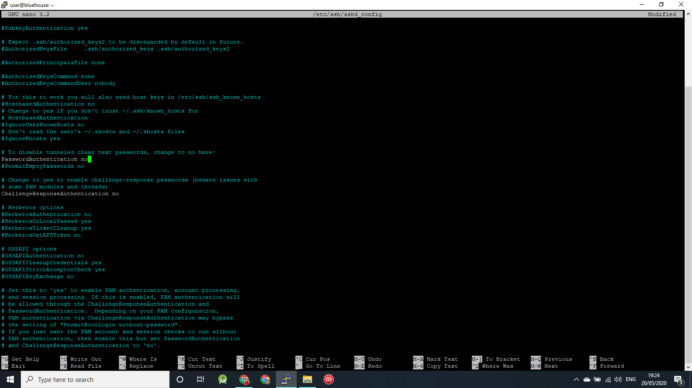
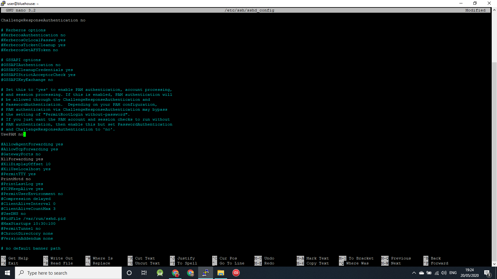
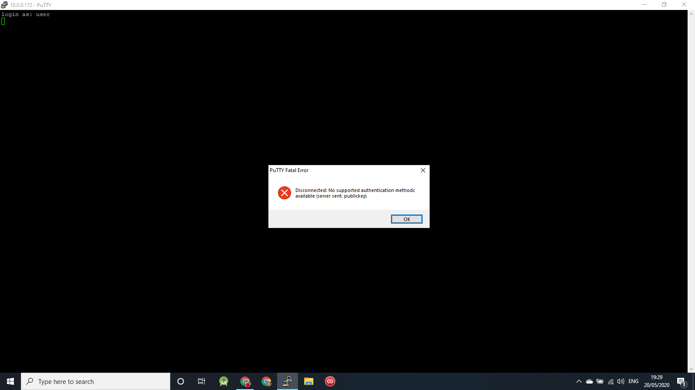
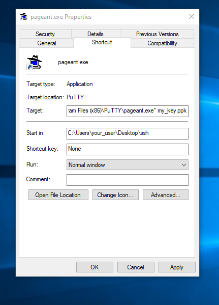
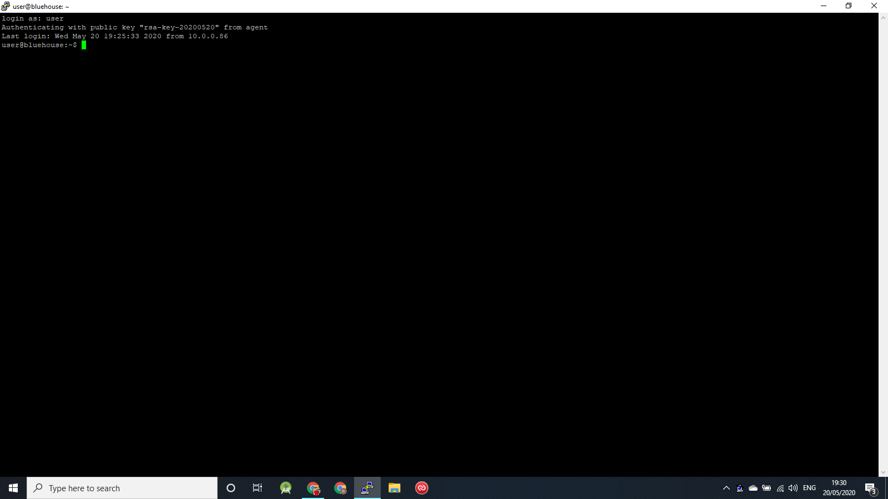

# This page is about securing your logins to your Debian machine

This is presumed to be on a fresh install having just come from the 'Installing Debian' page.  This is part 2 of 3 of installing and configuring your 'base system'.

## Configure sudo

At this point you should be staring at the login prompt for a fresh install, where you set up a root user with a password and a 'control' user with a password.  We will use that user for pretty much everything, but first we have to set up sudo so that we can use elevated priveleges when we need to, so first we must login as root.  Type 'root' at the login and press enter, then type your password (nothing will appear on the screen as you type - that's normal!) and press enter.

Now is also a good time to make sure the system is up to date, so run

```bash
apt-get update && apt-get upgrade -y
apt-get install sudo
```
 
The first line updates your repositories and upgrades anything that needs to be upgraded, the second line installs the sudo program.  

We then need to allocate sudo permissions to your user, so type:

```
usermod -aG sudo user
```

(replacing 'user' with your username)

Your screen should now look something like this:


Now type 'exit' and press enter to logout of root and return to the login prompt.  Login as your user.

Check that your user does have sudo permissions by running apt-get update

```
sudo apt-get update
```

You should see a warning (this will only appear once), and then have to put in your password.  This is your users password, not the root users password.  Once the password is entered succesfully the command should run and update the repositories.  IF IT DOESN'T, DO NOT PROCEED AND ASK FOR HELP!!

Asuming you just succeeded and proved you do have sudo priveleges, we are now going to disable all logins to the root user by creating a password that cannot exist

```
sudo usermod -p '!' root
```

Your screen should now look like this...


Type 'exit' and press enter to logout.  You now should not be able to login as root...


Now we're going to drop back to configuring things remotely from our **laptop** - if you're in a **VM** simply close the Console window.  If you're running Debian directly on the **host** (Single Purpose Install) then you can disconntect your monitor, keyboard and mouse now.

## Configuring SSH

Using your networking scanning tool on your **mobile** see what IP address your machine has been allocated..


Open Putty on your laptop and type the IP address in to the main bar and press Open.


A new window opens (accept the warning, this will only apear once) that is a terminal on your Debian machine.  Login with your username and password.


As discussed in the 'Security' page we are going to disable password logins by SSH and create a shared key which we will store on our **laptop**. Only your **laptop** will be able to connect via SSH in the future.  The only way to login with a password is to have physical access to the machine.  As per the screenshot, first we create the file to store the shared key in...

```
mkdir .ssh
nano .ssh/authorized_keys
```

This opens a blank text file.  Leave this open in the background for a minute.

When we installed Putty it installed a suite of tools for using SSH.  One is called PuttyGen, which we use to create the keys.  Open it now...


Press Generate, and then move your mouse around randomly on the grey panel.  This action generates the randomness that creates the key.  After a short while your new key will appear.  Highlight it all with your mouse and press ctrl+C to copy it to the clipboard.


Keep PuttyGen open in the background and go back to your blank text file in your terminal window and paste the key (press the right mouse button).  It is a LONG key so you will only see the last few digits of it initially after you paste.  Press the 'Home' key on your keyboard to jump back to the start of the line and make sure the key starts with 'ssh-rsa'.  Press ctrl+O to save the file.  Press enter to confirm.  Press ctrl+X to exit the file.

Now go back to PuttyGen and enter a passphrase for your private key file.  Press Save Private Key and choose a location to save the file.


## Configure Pageant

Now that we have set up the ssh key on your Debian machine, we now set up Pageant to load the keys on our **laptop** so it can authorise us when we login.  Pageant is another one of the suite of applications installed when we installed Putty.


When you open Pageant for the first time it puts a little icon of a computer wearing a hat in your system tray.  Right click on the icon and select 'Add Keys' from the pop-up menu.



Select your ppk file and you will be asked to verify your passphrase.



After this the key will be added to Pageant's list.



Close the Pageant window (the application remains running in the system tray) and return to your ssh terminal.  Type 'exit' to logout.  With Putty this will close the window.  Open Putty again, and type your machine's IP address.  This time when you press Open and enter your username in the terminal window, Putty checks with Pageant for your key, which it then uses to log you in...



## Disable password logins

So now all that is left to do is disable password based logins for ssh.  To do this type:

```
sudo nano /etc/ssh/sshd_config
```

This opens your ssh configuration file.  Carefully locate the three following keys, and change them to:

`PasswordAuthentication no`

`ChallengeResponseAuthentication no`

`UsePAM no`

See the following two screenshots...





Press ctrl+O to write the changes, enter to confirm, and ctrl+x to exit the editor.

Now type 'exit' to logout of the terminal.

To test that password logins have been disabled, we now need to stop Pageant so that Putty doesn't have access to your key.  Right click on the icon in the system tray and press 'exit'.

Now, try to login to your Debian machine using putty.  The session will be rejected...



## Start Pageant when windows boots

To ensure that your keys are ready whenever you are we'll set up Pageant to start when Windows boots.  In order to use it you will still need to input the passphrase for your ppk file.  You will be prompted for the passphrase when you login to windows, which will then unlock the ppk file and enable you to login to your machine(s) via ssh.

First get the path to your keyfile by finding it in your Windows file explorer, right clicking it and selecting 'Properites.  The path can be copied from the and 'Location' field in the helper window.  Close the helper window.

Now create the Pageant shortcut.  To do this, press Win+R and type 'shell:startup' in the run box.  A window appears.  Right click on the window and select 'New' > 'Shortcut'.

A helper appears asking "What item would you like to create a shortcut for?".  Press Browse and expand the tree to navigate to the Pageant executable as follows:  This PC > Local Disk (C:) > Program Files (x86) > Putty.

Click Pageant.exe and press OK.  Press Next, and Finish.  The shortcut appears in the original window.

Right click on the new shortcut and select properties.  In the Target box will be shown the path to pageant.exe .  Ensure that this path has double-quotes (") either end of it and after the end quote add a space type the name of your ppk file.

In the Start In box, paste the path we copied earlier...



Now double click on your Pageant shortcut to start it.  You will be prompted for your passphrase.  Enter the passphrase, start Putty and access your Debian machine's terminal.  Pageant provides the key and logs you in...



Next time you boot your laptop you will be prompted to unlock your key in Pageant.


