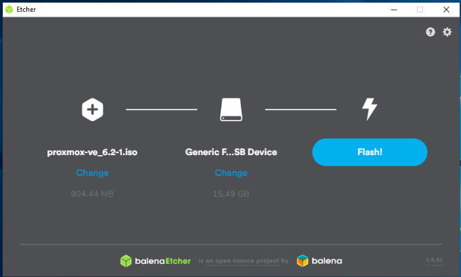

# Single purpose install

This page is for installing a **blue house** directly on your **host**

## Get Debian

**Project: Blue House** uses Debian because it has good package management and is easy to set up as a headless server.  It is a tried and tested method.  Download the latest minimal Debian ISO from [here](https://www.debian.org/distrib/netinst) (usually amd64).

# Install Debian

On your laptop use BalenaEtcher to write the Debian iso file to a USB stick.

Once it's done put the USB stick in to your **host** , make sure it is connected to ethernet, keyboard, mouse and monitor and turn it on.  Access the BIOS of the **host** (usually by pressing DEL or f12).

Ensure that the options are selected to enable booting from USB (above), and that your USB stick is the primary boot device (below).  Your BIOS options may look completely different, but these settings should be relatively easy to find.  Save and exit BIOS.

The system boots from your USB stick and presents you with the installation menu...

Now continue with the 'Creating a Debian base instructions'...
